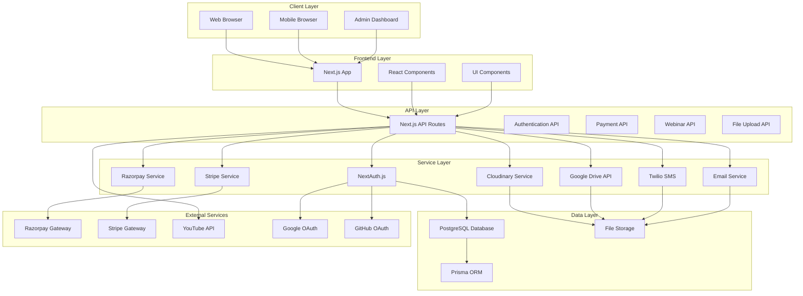
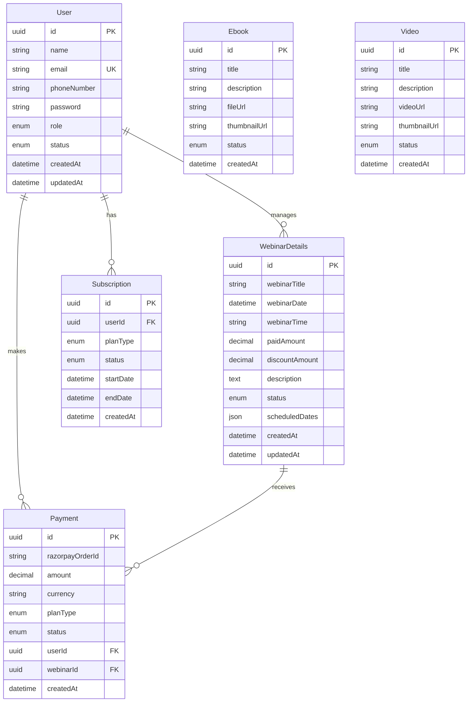
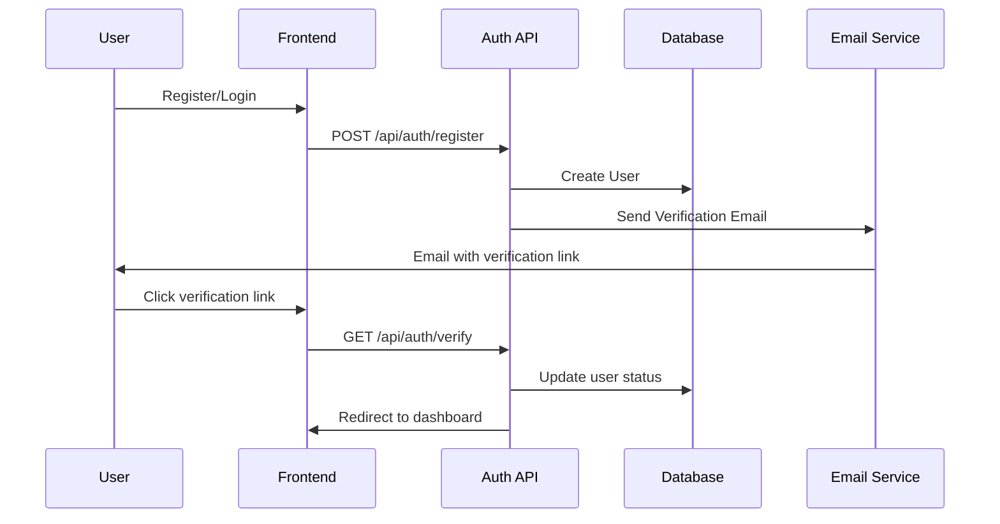
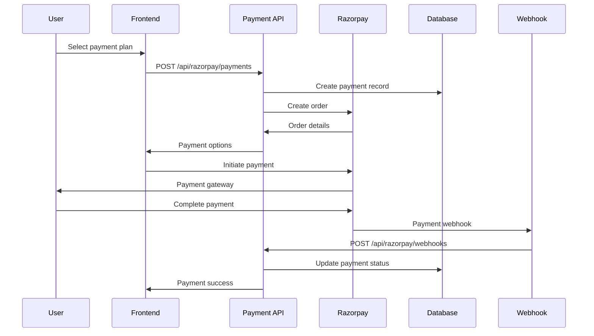

# System Architecture - Webinar Website

## 1. High-Level System Architecture



## 2. Database Schema Architecture



## 3. API Architecture

### 3.1 Authentication Flow


### 3.2 Payment Flow


## 4. Component Architecture

### 4.1 Frontend Component Tree
```
App
├── Layout
│   ├── Navbar
│   │   ├── LanguageSwitcher
│   │   ├── SignInButton
│   │   └── UserDropdown
│   ├── ThemeProvider
│   └── Footer
├── Pages
│   ├── HomePage
│   │   ├── LandingSection
│   │   ├── WebinarListings
│   │   ├── PricingSection
│   │   └── FAQSection
│   ├── AuthPages
│   │   ├── LoginPage
│   │   ├── RegisterPage
│   │   └── VerifyPage
│   ├── Dashboard
│   │   ├── UserProfile
│   │   ├── WebinarAccess
│   │   └── PaymentHistory
│   └── WebinarPages
│       ├── LiveWebinar
│       ├── VideoPlayer
│       └── EbookViewer
└── Components
    ├── UI
    │   ├── Button
    │   ├── Input
    │   ├── Modal
    │   └── Toast
    ├── Webinar
    │   ├── WebinarCard
    │   ├── WebinarList
    │   └── WebinarPlayer
    └── Payment
        ├── SubscriptionButton
        ├── PaymentModal
        └── PlanSelector
```

## 5. Security Architecture

### 5.1 Authentication Security
```
┌─────────────────────────────────────────────────────────────┐
│                    Security Layers                          │
├─────────────────────────────────────────────────────────────┤
│ Layer 1: Client Security                                   │
│ ├── HTTPS Enforcement                                      │
│ ├── CSP Headers                                            │
│ ├── XSS Protection                                         │
│ └── CSRF Protection                                        │
│                                                           │
│ Layer 2: API Security                                      │
│ ├── Rate Limiting                                          │
│ ├── Input Validation                                       │
│ ├── SQL Injection Prevention                               │
│ └── Authentication Middleware                              │
│                                                           │
│ Layer 3: Data Security                                     │
│ ├── Password Hashing (bcrypt)                             │
│ ├── JWT Token Encryption                                   │
│ ├── Database Encryption                                    │
│ └── File Upload Validation                                │
│                                                           │
│ Layer 4: Payment Security                                  │
│ ├── Webhook Signature Verification                         │
│ ├── Payment Data Encryption                               │
│ ├── PCI Compliance                                         │
│ └── Fraud Detection                                        │
└─────────────────────────────────────────────────────────────┘
```

## 6. Performance Architecture

### 6.1 Caching Strategy
```
┌─────────────────────────────────────────────────────────────┐
│                    Caching Layers                          │
├─────────────────────────────────────────────────────────────┤
│ Browser Cache                                              │
│ ├── Static Assets (CSS, JS, Images)                       │
│ ├── API Responses (ETags)                                  │
│ └── Service Worker Cache                                   │
│                                                           │
│ CDN Cache                                                  │
│ ├── Global Content Delivery                                │
│ ├── Image Optimization                                     │
│ └── Static File Caching                                    │
│                                                           │
│ Server Cache                                               │
│ ├── Database Query Caching                                 │
│ ├── API Response Caching                                   │
│ └── Session Storage                                        │
│                                                           │
│ Database Cache                                             │
│ ├── Query Result Caching                                   │
│ ├── Connection Pooling                                     │
│ └── Index Optimization                                     │
└─────────────────────────────────────────────────────────────┘
```

## 7. Scalability Architecture

### 7.1 Horizontal Scaling Strategy
```
┌─────────────────────────────────────────────────────────────┐
│                Scaling Strategy                            │
├─────────────────────────────────────────────────────────────┤
│ Load Balancer                                             │
│ ├── Multiple Server Instances                             │
│ ├── Health Checks                                         │
│ └── Traffic Distribution                                   │
│                                                           │
│ Application Servers                                       │
│ ├── Stateless Architecture                                │
│ ├── Session Management via JWT                            │
│ └── Auto-scaling Groups                                   │
│                                                           │
│ Database Scaling                                           │
│ ├── Read Replicas                                         │
│ ├── Connection Pooling                                    │
│ └── Sharding Strategy                                     │
│                                                           │
│ File Storage Scaling                                       │
│ ├── CDN Distribution                                       │
│ ├── Cloud Storage (Cloudinary)                            │
│ └── Backup & Recovery                                     │
└─────────────────────────────────────────────────────────────┘
```

## 8. Monitoring & Observability

### 8.1 Monitoring Stack
```
┌─────────────────────────────────────────────────────────────┐
│                    Monitoring Architecture                  │
├─────────────────────────────────────────────────────────────┤
│ Application Monitoring                                     │
│ ├── Error Tracking (Sentry)                               │
│ ├── Performance Monitoring (Vercel Analytics)             │
│ ├── User Analytics (Google Analytics)                     │
│ └── Real-time Monitoring                                  │
│                                                           │
│ Infrastructure Monitoring                                  │
│ ├── Server Health Checks                                  │
│ ├── Database Performance                                  │
│ ├── API Response Times                                    │
│ └── Resource Utilization                                   │
│                                                           │
│ Business Intelligence                                      │
│ ├── User Behavior Analytics                               │
│ ├── Revenue Tracking                                       │
│ ├── Content Performance                                   │
│ └── Conversion Funnels                                    │
└─────────────────────────────────────────────────────────────┘
```

## 9. Deployment Architecture

### 9.1 CI/CD Pipeline
```
┌─────────────────────────────────────────────────────────────┐
│                    Deployment Flow                         │
├─────────────────────────────────────────────────────────────┤
│ Development                                                │
│ ├── Local Development                                      │
│ ├── Hot Reloading                                         │
│ └── Environment Variables                                  │
│                                                           │
│ Testing                                                    │
│ ├── Unit Tests (Jest)                                     │
│ ├── Integration Tests                                      │
│ ├── E2E Tests (Playwright)                                │
│ └── Performance Tests                                      │
│                                                           │
│ Staging                                                    │
│ ├── Pre-production Environment                            │
│ ├── Database Migrations                                   │
│ ├── Integration Testing                                   │
│ └── User Acceptance Testing                               │
│                                                           │
│ Production                                                 │
│ ├── Vercel Deployment                                     │
│ ├── Database Migration                                     │
│ ├── Health Checks                                         │
│ └── Monitoring Setup                                       │
└─────────────────────────────────────────────────────────────┘
```

## 10. Data Flow Architecture

### 10.1 User Journey Flow
```
┌─────────────────────────────────────────────────────────────┐
│                    User Journey                            │
├─────────────────────────────────────────────────────────────┤
│ 1. User Registration                                      │
│    ├── Email Verification                                 │
│    ├── Profile Creation                                   │
│    └── Welcome Email                                      │
│                                                           │
│ 2. Webinar Discovery                                      │
│    ├── Browse Webinars                                    │
│    ├── Filter by Category                                 │
│    └── Search Functionality                               │
│                                                           │
│ 3. Payment Process                                        │
│    ├── Plan Selection                                     │
│    ├── Payment Gateway                                    │
│    └── Order Confirmation                                 │
│                                                           │
│ 4. Content Access                                         │
│    ├── Video Streaming                                    │
│    ├── Ebook Downloads                                    │
│    └── Live Webinar Access                                │
│                                                           │
│ 5. User Engagement                                        │
│    ├── Progress Tracking                                  │
│    ├── Feedback Collection                                │
│    └── Community Features                                 │
└─────────────────────────────────────────────────────────────┘
```

---

*This architecture document provides detailed technical specifications for the webinar website system, including data flow, security, performance, and scalability considerations.* 